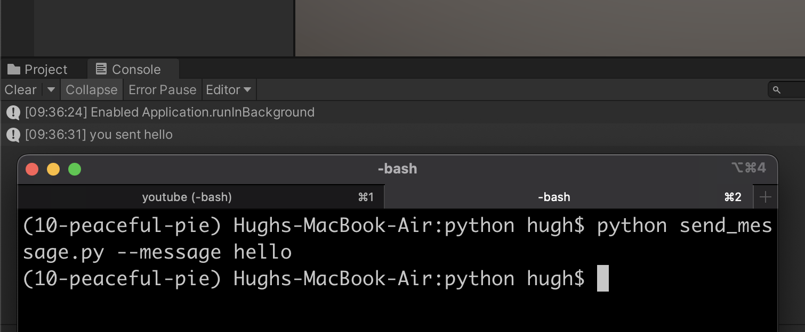

# Examples

## [SimpleNetworking](SimpleNetworking)

Send primitive types and dataclasses to and from Unity

## [DungeonEscape](DungeonEscape)

Run the Dungeon Escape example provided with mlagents, https://github.com/Unity-Technologies/ml-agents/tree/27219893831b011aaa6042b25d63f9c122f50065/Project/Assets/ML-Agents/Examples/DungeonEscape , but WITHOUT mlagents!
